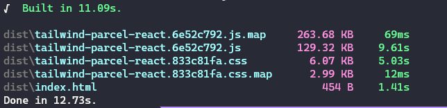

# Tailwind React Parcel Boilerplate

> As minimal as possible

Use this project as a template for your simple projects.

The commands `yarn build` and `yarn start` are ready to go as soon as you install your dependencies.

## Build stats
